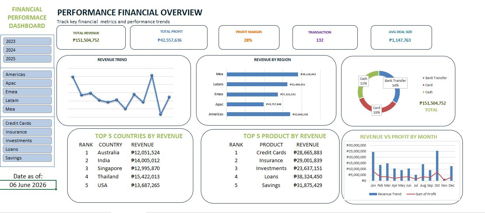

# 💰 Financial Performance Dashboard — Excel

An interactive Excel dashboard for tracking key financial metrics and performance trends across regions, products, and countries — with dynamic slicers for year, region, and product filtering.

---

## 📸 Preview

---

## 📁 Files

| File | Description |
|---|---|
| `financial_performance_dashboard.xlsx` | Main Excel dashboard file |
| `dashboard.png` | Dashboard screenshot preview |

---

## ✨ Features

- ✅ Interactive slicers — **Year**, **Region**, and **Product** filters
- ✅ KPI cards — Total Revenue, Total Profit, Profit Margin, Transactions, Avg Deal Size
- ✅ **Revenue Trend** line chart (monthly performance)
- ✅ **Revenue by Region** horizontal bar chart
- ✅ **Payment Method** donut chart (Bank Transfer, Card, Cash)
- ✅ **Top 5 Countries by Revenue** ranked table
- ✅ **Top 5 Products by Revenue** ranked table
- ✅ **Revenue vs Profit by Month** combo chart
- ✅ Live **Date as of** display
- ✅ Pivot Tables with fully dynamic filtering

---

## 📊 Dashboard Sections

### KPI Cards
| Metric | Value |
|---|---|
| Total Revenue | ₱151,504,752 |
| Total Profit | ₱42,557,636 |
| Profit Margin | 28% |
| Transactions | 132 |
| Avg Deal Size | ₱1,147,763 |

### Revenue by Region
| Region | Revenue |
|---|---|
| Mea | ₱30,138,463 |
| Latam | ₱32,408,651 |
| Emea | ₱27,331,552 |
| Apac | ₱19,757,848 |
| Americas | ₱33,868,238 |

### Payment Method Breakdown
| Method | Share |
|---|---|
| Bank Transfer | 34% |
| Card | 35% |
| Cash | 31% |

### Top 5 Countries by Revenue
| Rank | Country | Revenue |
|---|---|---|
| 1 | Australia | ₱12,051,524 |
| 2 | India | ₱14,005,012 |
| 3 | Singapore | ₱12,995,870 |
| 4 | Thailand | ₱15,422,013 |
| 5 | USA | ₱13,687,265 |

### Top 5 Products by Revenue
| Rank | Product | Revenue |
|---|---|---|
| 1 | Credit Cards | ₱28,665,883 |
| 2 | Insurance | ₱29,001,839 |
| 3 | Investments | ₱23,637,151 |
| 4 | Loans | ₱38,324,450 |
| 5 | Savings | ₱31,875,429 |

---

## 🔍 Filters Available

| Slicer | Options |
|---|---|
| Year | 2023, 2024, 2025 |
| Region | Americas, Apac, Emea, Latam, Mea |
| Product | Credit Cards, Insurance, Investments, Loans, Savings |

---

## 🛠 Tools Used

- Microsoft Excel
- Pivot Tables & Pivot Charts
- Slicers
- KPI Card Design (merged cells, custom borders)
- Line chart, Bar chart, Donut chart, Combo chart

---

## 📌 How to Use

1. Download the `financial_performance_dashboard.xlsx` file
2. Open in **Microsoft Excel**
3. Use the **Year** slicer to filter by 2023, 2024, or 2025
4. Use the **Region** slicer to drill down by geographic area
5. Use the **Product** slicer to filter by financial product type
6. All KPI cards, charts, and tables update automatically

---

## 📈 Key Insights

- **Loans** is the top revenue-generating product at **₱38,324,450**
- **Americas** leads all regions with **₱33,868,238** in revenue
- Overall **Profit Margin** stands at a healthy **28%**
- Payment methods are nearly evenly split — Card (35%), Bank Transfer (34%), Cash (31%)
- **Thailand** is the highest-earning country at **₱15,422,013**
- Total transactions recorded: **132** with an average deal size of **₱1,147,763**

---

## 👤 Author
Rajahmuden Dalaten
